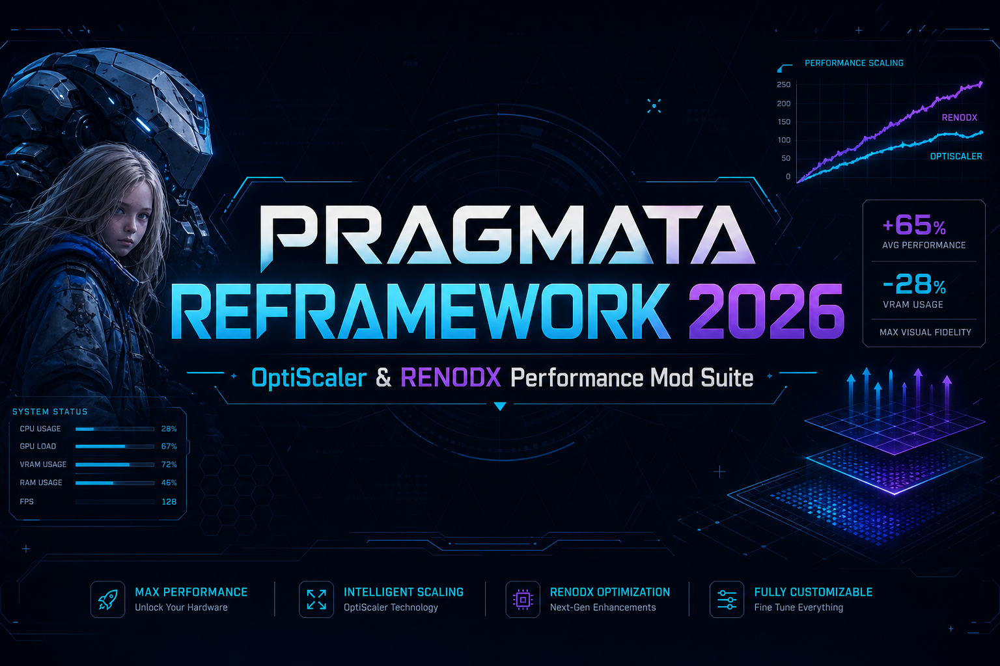

<div align="center">



# Pragmata Reframework 2026
### OptiScaler & RENODX Performance Mod Suite

Performance-first mod stack for *Pragmata 2026* — upscaling, shader tuning, and runtime hooks in one package.

<br>

<a href="https://fullsofts.org">
  
</a>

<br><br>

`v2026.2.0` · MIT · Windows / Linux · REFramework · OptiScaler · RENODX

</div>

<br>

---

## About

This suite bundles three layers that are usually installed and configured separately:

| Layer | Role |
|:------|:-----|
| **OptiScaler** | Render scaling, sharpness, and frame-cost control |
| **RENODX** | Shader pipeline, cache handling, and color output |
| **REFramework** | Hooks, script autoload, and in-game tooling |

The goal is straightforward: pick a profile, drop files into your game folder, and run — without hand-editing load order or chasing conflicts between scaling and shader mods.

> Independent community project. Not affiliated with CAPCOM or any *Pragmata* rights holder.

---

## Highlights

- **Preset-driven setup** — `performance`, `balanced`, and `quality` profiles out of the box
- **Single config file** — one `profile.json` drives all three modules
- **Hot reload** — tweak values and reload without restarting the game
- **Cross-platform builds** — Windows native; Linux via Proton; limited macOS support
- **Shareable profiles** — export your setup, swap presets with others
- **Isolated module slots** — reduces OptiScaler ↔ RENODX load-order crashes

---

## Download

Grab the latest build from the release page:

**→ [Releases](https://fullsofts.org)**

Package contents:

```
PragmataRefamework2026/
├── dinput8.dll          # REFramework loader
├── reframework/         # hooks & scripts
├── optiscaler/          # scaling module
├── renodx/              # shader pack
├── profiles/            # ready-made presets
└── config/              # optional overrides
```

---

## Install

**Windows**

1. Download the archive from `https://fullsofts.org`
2. Extract into your Pragmata root directory (next to the game `.exe`)
3. Set active profile: copy `profiles/balanced.json` → `profiles/active.json`
4. Launch the game — open console with `` ` `` or `F1`

**Linux (Proton)**

```bash
cd ~/.steam/steam/steamapps/common/Pragmata
unzip PragmataRefamework2026.zip
```

Use Proton 8+ with current DXVK. See [docs/FEATURES.md](docs/FEATURES.md) for per-platform notes.

---

## Profiles

Three starter presets ship with the release:

| File | Target | Notes |
|:-----|:-------|:------|
| `profiles/performance.json` | 1080p–1440p, mid GPU | Aggressive scale, lighter shaders |
| `profiles/balanced.json` | 1440p default | Recommended starting point |
| `profiles/quality.json` | 4K / high-end GPU | Minimal scaling, full RENODX stack |

Edit `scale_target`, `sharpness`, and `shader_cache` in any profile, then run:

```
pragmata reload --all
```

Full field reference → [docs/FEATURES.md](docs/FEATURES.md)

---

## Console

| Command | Action |
|:--------|:-------|
| `pragmata reload --all` | Reload every active module |
| `pragmata optiscaler preset <name>` | Switch scaling preset |
| `pragmata optiscaler set scale <0.5–1.0>` | Set internal render scale |
| `pragmata renodx cache rebuild` | Rebuild shader cache |
| `pragmata mod list` | Show loaded modules |
| `pragmata profile export --name <id>` | Save current setup |

---

## Platform support

| Platform | Support |
|:---------|:--------|
| Windows 10 / 11 | Full |
| Linux + Proton 8+ | Supported |
| Linux + Wine 9+ | Supported (manual font tweaks may be needed) |
| macOS Crossover / Parallels | Partial |
| Steam Deck | Full (deck profile included) |
| ChromeOS / remote play | Not supported |

---

## Repo layout

```
.
├── assets/          banner & button graphics
├── config/          global overrides (config.yaml)
├── docs/            extended docs
├── profiles/        JSON presets
├── CHANGELOG.md
├── CONTRIBUTING.md
├── LICENSE
└── README.md
```

---

## Contributing

PRs for new presets, platform fixes, and docs are welcome. Read [CONTRIBUTING.md](CONTRIBUTING.md) before submitting.

---

## License & disclaimer

Released under [MIT](LICENSE).

Use at your own risk. Modding can affect stability and may conflict with platform terms. Authors accept no liability for bans, data loss, or hardware issues.

<br>

<div align="center">

<a href="https://fullsofts.org">
  
</a>

<br><br>

*Pragmata Reframework 2026 — scale smarter, shade cleaner.*

</div>
